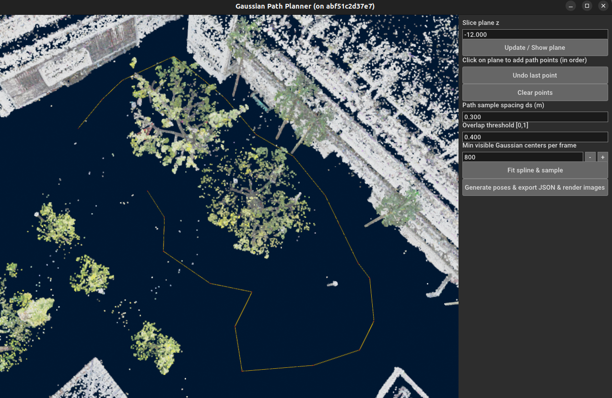
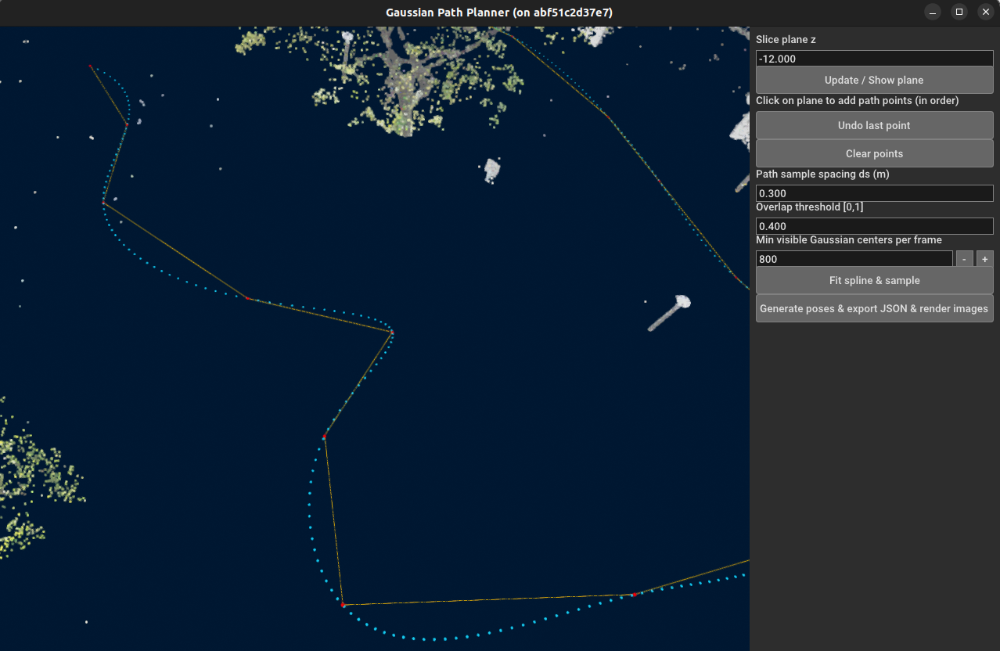
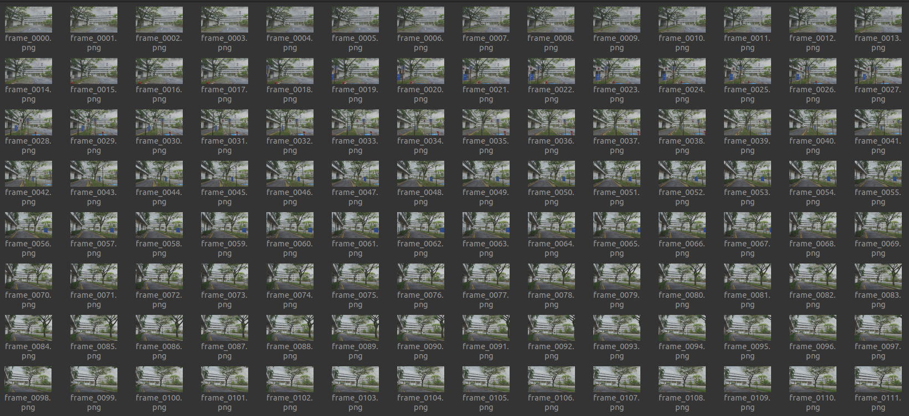
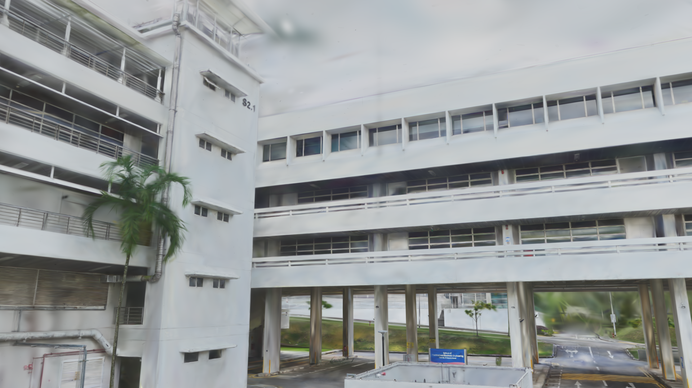

# 高斯溅射交互式路径规划与渲染工具

本工具能够读取高斯溅射模型，设置水平切片平面并通过点击生成路径，拟合样条并采样相机位姿，然后批量渲染 RGB 与深度图（含进度与统计）。

语言：[English](./readme.md) | 简体中文（当前）

## 功能一览
- 载入 `.npz` / `.ply` 高斯模型（支持 3DGS 字段：`f_dc_*`、`scale_*`、`rot_*`、`opacity` 等）
- 交互设置平面 z；按住 Shift + 左键在平面上依次点击路径点
- 拟合 B 样条并按间距 `ds` 采样
- 以“最小可见点数 + 可见集合 Jaccard 重叠”筛选位姿
- 导出 `planned_poses_*.json`（内参、T_wc、统计）
- 渲染 RGB 与深度（16-bit PNG，毫米），右侧显示实时进度与最终统计

## 开发与部署
### 开发（Dev Containers）
```bash
cd /workspace/src/manual_splat
bash run.bash
# 或：python3 manual_plane.py --gaussians /workspace/src/data/point_cloud_gs.ply
```

### 部署（运行脚本）
```bash
bash docker/run_all.bash \
  --gaussians $(pwd)/src/data/point_cloud_gs.ply \
  --outdir $(pwd)/output
```
常用：`--build-local`、`--dev`、`--runtime-nvidia`、`--safe`、`--cpus`、`--mem`。

脚本将输出到 `outdir/rgb/<N>/`、`outdir/depth/<N>/`、`outdir/poses/planned_poses_<N>.json`。

## 交互说明
- 视角：左键旋转、右键平移、滚轮缩放
- 平面：右侧 `Slice plane z` 设置高度并点击 `Update / Show plane`

  

- 画线：按住 Shift + 左键在平面上依次点击；两点后出现橙色折线（为避免与平面深度冲突，折线绘制在平面上方极小位移）
- 采样：`Fit spline & sample`

  

- 导出与渲染：`Generate poses & export JSON & render images`

  

  

  


渲染过程右侧显示 `Rendering RGB i/N` 与 `Rendering Depth j/M`；结束后弹窗展示统计与输出位置。


## 致谢
- Open3D GUI 框架
- gsplat 渲染器
- Gaussian Splatting 论文与实现
