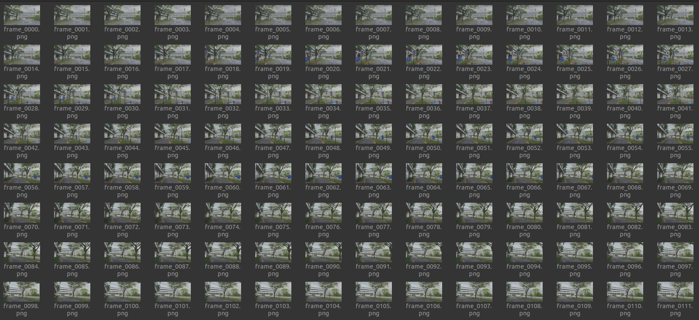

# Interactive Path Planning and Rendering for Gaussian Splatting

English | [简体中文](./README.zh-CN.md)

This tool loads a Gaussian Splatting model, lets you interactively pick a slicing plane and place control points on it, fits a smooth path, samples camera poses, filters them by visibility/overlap, and renders RGB and depth images with progress feedback.

---

## Features
- Load `.npz` / `.ply` models (3DGS fields supported: `f_dc_*`, `scale_*`, `rot_*`, `opacity`)
- Interactively set a horizontal slicing plane `z = const`
- Place path points in order on the plane (hold Shift + Left Click)
- Fit a B‑spline and sample by spacing `ds`
- Filter poses by min visible points and Jaccard overlap
- Export `planned_poses_*.json` (intrinsics, T_wc, stats)
- Render RGB and depth (16‑bit PNG in millimeters) with progress and final summary

---

## Development and Deployment

### Dev mode (VS Code Dev Containers)

Prereqs: Docker, NVIDIA driver + NVIDIA Container Toolkit (GPU), VS Code + Dev Containers.

Inside the container:
```bash
cd /workspace/src/manual_splat
bash run.bash
# or
# python3 manual_plane.py --gaussians /workspace/src/data/point_cloud_gs.ply --imgw 1920 --imgh 1080
```

### Deploy mode (run image)

Recommended script (builds if missing):
```bash
bash docker/run_all.bash \
  --gaussians $(pwd)/src/data/point_cloud_gs.ply \
  --outdir $(pwd)/output
```

### Script: `docker/run_all.bash` (excerpt)

Inputs:
- `--gaussians PATH`: model (.ply/.npz), mounted as `/mnt/gaussians.ply`
- `--outdir DIR`: base output; script uses `rgb/`, `depth/`, `poses/` subfolders

Camera: `--fov`, `--imgw`, `--imgh`, `--near`, `--far`

Sampling/filters: `--ds`, `--min-visible`, `--overlap-ratio`

Container/limits: `--cpus`, `--mem`, `--omp`, `--safe`, `--runtime-nvidia`, `--dev`

---

## Launch the interactive planner
```bash
cd manual_splat
bash run.bash
```

```bash
bash docker/run_all.bash 
```

### UI and interactions

- View: Left drag rotate, Right drag pan, Wheel zoom
- Plane: set `Slice plane z` and click `Update / Show plane`

  

- Draw: hold Shift + Left Click on the green plane to add points; after 2 points an orange polyline appears (drawn slightly above the plane for visibility)
- Sample: `Fit spline & sample`

  

- Export & render: `Generate poses & export JSON & render images`

  

  

  


Rendering shows real‑time progress (RGB i/N, Depth j/M). When done, a dialog summarizes counts and output locations.


---

## Acknowledgements
- Open3D GUI framework
- gsplat renderer
- Gaussian Splatting paper & implementations
