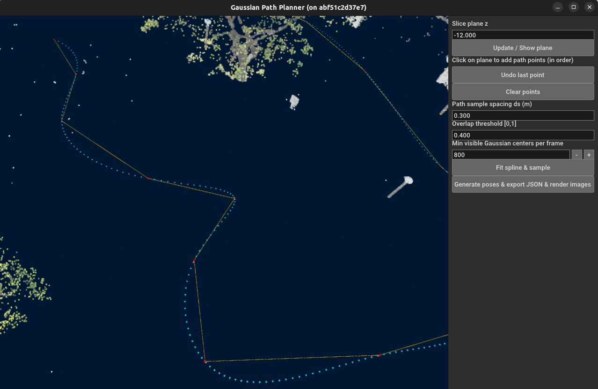

# 高斯溅射交互式路径规划与渲染工具

本工具是高斯溅射模型→基于sfm图像定位（hloc）pipeline的一部分。本工具能够读取高斯溅射模型，设置水平切片平面并通过点击生成一个可被自动平滑并均匀采样的路径，在每个采样点上，本工具自动寻找适合后续做sfm建图的溅射方向，最终进行图像渲染并保存。

---

## 功能一览
- 载入高斯溅射模型（`.npz` 或 `.ply`，支持 3DGS 的 `f_dc_* / scale_* / rot_* / opacity` 等字段）
- 交互设置水平切片平面 `z = const`
- 在平面上**顺序点击**路径点（默认：**按住 Shift + 左键**添加点，避免与旋转冲突）
- 拟合 B 样条并按间距采样
- 依据“**最小可见点数** + **相邻帧可见点重叠**”筛选相机位姿
- 导出 `planned_poses.json`（含内参、`T_wc` 外参、统计信息）
- 调用渲染脚本批量出图

---

## 安装依赖(docker)
```bash
docker pull stephenmao0927/gsr:v2
cd docker
docker compose -f compose.yml up
```

---

## 启动交互式规划器
```bash
cd manual_splat
bash run.bash
```

**[Update]** 傻瓜式启动脚本

```bash
docker pull stephenmao0927/gsr:v2   #先拉取镜像
bash docker/run_all.bash   #一步到位启动container、设置参数和启动
```

### 界面与交互

- **视角控制**：左键拖动旋转、右键拖动平移、滚轮缩放  

- **选平面**：右侧 `Slice plane z` 输入框设置 z，点 `Update / Show plane` 刷新蓝色平面 

  

- **拾取路径点**：**按住 Shift + 左键**在平面上依次点击  
  
  - `Undo last point` 撤销最后一点  
  - `Clear points` 清空所有点  
  
- **拟合与采样**：`Fit spline & sample`

  

- **生成与导出**：`Generate poses & export JSON & render images` → 输出json和png

  **[Update 2025/09/19]** 同时会生成每个位置对应的深度图，以16 位 PNG 图像按照mm(`depth_scale=1000.0`)为单位保存。

  
  
  
  
  

---

## 参数建议（SfM 友好）

- `ds`（样条采样间距）：0.2–0.5 m，转弯/复杂区域更小  
- `overlap_ratio`（Jaccard 重叠）：0.3–0.5  
- `min_visible`：依点云稠密度设定，稀疏场景适度降低  
- `near/far`：覆盖主要结构，过滤过近/过远干扰  
- FOV：过小不利重叠，过大畸变重；一般 60–90°

---

## 致谢
- Open3D GUI 框架
- gsplat 渲染器
- Gaussian Splatting 原始论文 & 实现
